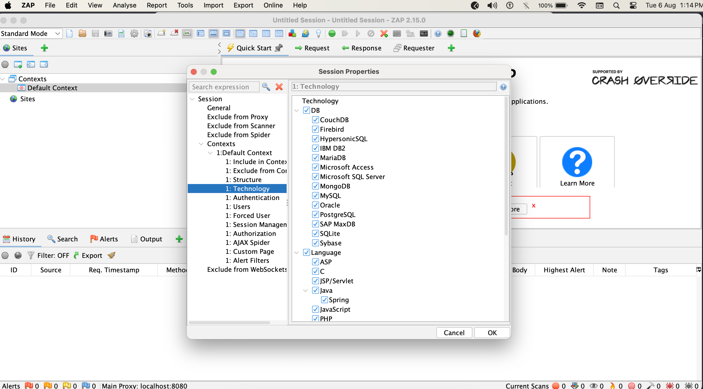
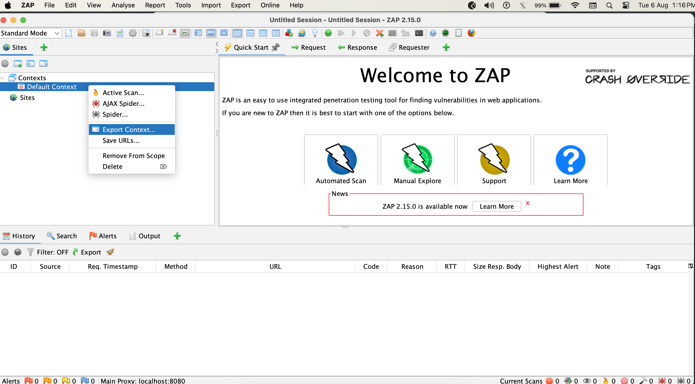
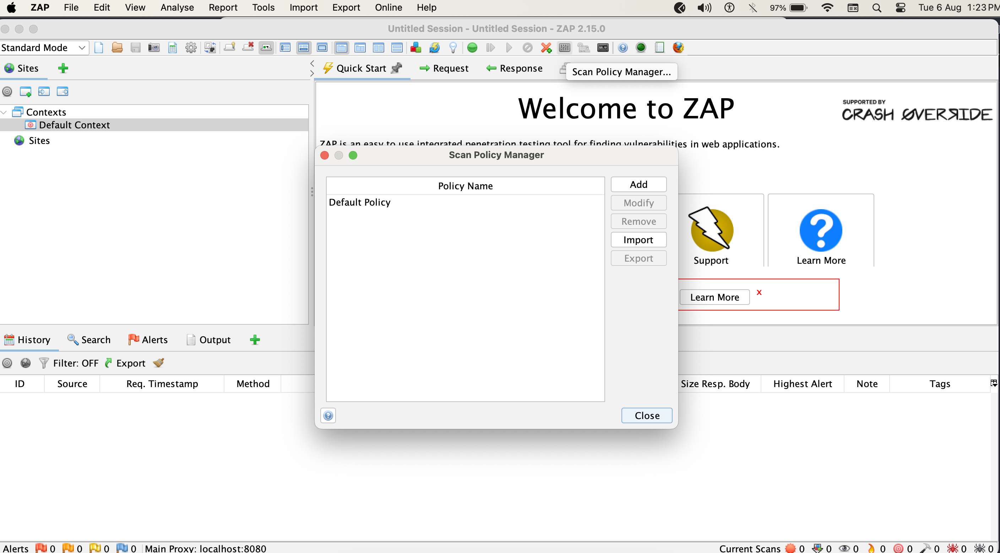
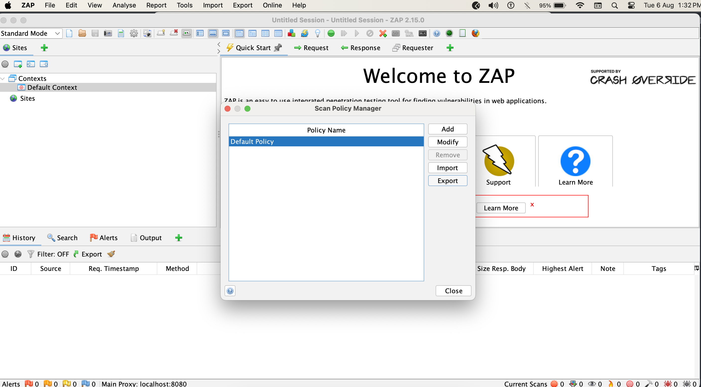

This repo is used for the pentesting using the [ZAP](https://www.zaproxy.org/)'s [stable docker image](https://www.zaproxy.org/docs/docker/about/)

### 1) Preparing VAPT-ZAPConfigs directory

The directory should have the same structure like `VAPT-ZapConfig` directory.
It should contain the following files and folders in it -

1. extra_modules/ - (required, if the `authentication.py` script has some external dependency)
2. AlertFilters.csv
3. authentication.py - (mandatory)
4. Default Context.context - (mandatory)
5. Default Policy.policy - (mandatory)
6. script_params.json - (required, if the `authentication.py` script has some parameters defined in it)
7. swagger_schema.json
8. urls.txt

Note: All the file and folder names inside configs dir should be exactly same as above. Mismatch in any name will cause some
unexpected error.

1. `extra_modules/`

   This is a directory containing any additional module required by jython engine to execute the script.
   For example, if using the `cognito` sample script, it needs some additional modules. Extract the `extra_modules.zip`
   file from `Sample Modules` and use it.
2. `AlertFilters.csv`

   A csv file listing all the alerts which needs to be marked False Positive.`Note:`
   1. `AlertID` is a mandatory column in this csv file
   2. Do not change the csv headers

3. `authentication.py`

   A script used to authenticate into the application.
   - This is a `jython` script compatible with ZAP authentication mechanism.So, don't get confused because of the `.py` extension.
     For reference, look in the Sample Scripts directory. You can modify the scripts or use them directly as is.
   - If your application uses cognito then you can use/modify the `cognito.py` file.
   - If you want to add direct token than copy content of direct_token.py file into `authentication.py`  and update your token in `sendingRequest`  method.

4. Download the [ZAP](https://www.zaproxy.org/download/) application.(for Mac, you need to "Enable Anywhere installation" using the command `sudo spctl --master-disable` )

5. Generate the  `Default Context.context` A ZAP context file containing the information about the
   - Open Zap and update the "Default Context" by choosing relevent technologies and other configuration:
     
   - Rest of the required details will be added automatically during runtime
   - Export the Context file using export option.
     
   - Copy this file content into `Default Context.context`

6. Generate  `Default Policy.policy`
   A ZAP scan policy which contains the list of attacks to perform during the scan and their corresponding threshold and strength.
   * Lets generate the policy file using ZAP. Click on `Scan policy manager`  and update according to requirement.

     
   * Export the policy by selecting `Default policy.policy` and `Export `
     

7. `script_params.json`

   - If you want to get authneticationm token from AWS-Congnito than update this file A json file containing all the parameters defined in the authentication script (except username and password), with their values.
   - NOTE: If you are using other authentication method or direct-token than use `direct_token.py`  than leave it as empty json file.

8. `swagger_schema.json`

   - In case if the swagger is not hosted, then the json file can be used directly.

9. `urls.txt`

   TXT file containing the list of URLs which needs to be added into ZAP, and are not available in the swagger json.

   ### 2) Building the docker image


   - Once VAPT-ZAPConfig Was ready then build docker image using below command.

   ```commandline
      docker build \
       -t vapt-tool:latest \
       -f Dockerfile \
       .
   ```

   or you can use the pre-built image directly from [docker hub](https://hub.docker.com/r/techprescient/vapt)

   ```commandline
   docker pull techprescient/vapt:latest 
   ```

   ### 3) Running the docker image -

   ```commandline
   docker run \
       -p 8080:8080 \
       -u 0 \
       -v <VAPT-ZAPConfigs-dir-full-path>:/tmp/ZAPConfigs/ \
       -v <Zap-report-output-dir-full-path>:/reports/ \
       -i \
       -e TARGET_URL="https://your-site.com/" \
       -e LOGGED_OUT_INDICATOR_REGEX="logout-indicatior-for-your-application" \
       -e USERNAME="your-username" \
       -e PASSWORD="password" \
       -e SWAGGER_JSON_URL="https://your-site.com/api-docs" \
       vapt-tool:latest
   ```

   Add any extra env variable in the docker run command, if needed.

   For example, if you are using the sample cognito script (discussed later) as the authentication script then
   `AWS_DEFAULT_REGION` should be passed as env variable in the docker run command.

   `Note:` Do __NOT__ change the container directories in the run command.
   Only change the host machine directories and env variable values.

### 3) Monitoring if scan was started by confirming below logs:

```commandline
path to your folder % `docker run     -p 8080:8080     -u 0    -v VAPT-ZAPConfigs-dir-full-path:/tmp/ZAPConfigs/ \     -v Zap-report-output-dir-full-path:/report/ \     -i     -e TARGET_URL="https://your-site.com/"     vapt-tool:latest`

2024-08-06 09:30:57,908 Trigger hook: cli_opts, args: 1

2024-08-06 09:30:57,908 Using port: 8080

2024-08-06 09:30:57,908 Trigger hook: start_zap, args: 2

2024-08-06 09:30:57,909 Starting ZAP

2024-08-06 09:30:57,911 Params: ['/zap/zap-x.sh', '-daemon', '-port', '8080', '-host', '0.0.0.0', '-config', 'database.recoverylog=false', '-config', 'api.disablekey=true', '-config', 'api.addrs.addr.name=.*', '-config', 'api.addrs.addr.regex=true', '-config', 'spider.maxDuration=0', '-silent', '-addoninstallall', '-addonupdate']

2024-08-06 09:30:59,948 Starting new HTTP connection (1): localhost:8080

`....`

2024-08-06 09:32:41,442 Starting new HTTP connection (1): localhost:8080

2024-08-06 09:32:42,593 http://localhost:8080 "GET http://zap/JSON/core/view/version/ HTTP/1.1" 200 20

2024-08-06 09:32:42,595 ZAP Version 2.15.0

2024-08-06 09:32:42,595 Took 104 seconds

2024-08-06 09:32:42,596 Trigger hook: zap_started, args: 2

2024-08-06 09:32:42,597 [#########################] - Executing zap_started hook ...

2024-08-06 09:32:42,597 [#########################] - Waiting till all the available addons are installed ...

2024-08-06 09:32:42,600 Starting new HTTP connection (1): localhost:8080

2024-08-06 09:32:42,640 http://localhost:8080 "GET http://zap/JSON/autoupdate/view/marketplaceAddons/ HTTP/1.1" 200 81615

2024-08-06 09:32:42,644 Starting new HTTP connection (1): localhost:8080

2024-08-06 09:32:42,675 http://localhost:8080 "GET http://zap/JSON/autoupdate/view/installedAddons/ HTTP/1.1" 200 70867

2024-08-06 09:32:42,677 [#########################] - `Available addons = 108 ||| Installed addons = 108`

2024-08-06 09:32:47,687 [#########################] - `Addon installation complete.`

2024-08-06 09:32:47,695 [#########################] - Adding URLs into zap from txt file ...

2024-08-06 09:32:53,995 https://your-site-url:443 "GET /settings HTTP/1.1" 404 207

2024-08-06 09:32:53,998 [#########################] - `URLs added successfully.`

2024-08-06 09:32:54,002 [#########################] - `Importing Swagger from file...`

2024-08-06 09:32:54,004 Starting new HTTP connection (1): localhost:8080

2024-08-06 09:32:55,204 http://localhost:8080 "GET http://zap/JSON/openapi/action/importFile/?file=%2Ftmp%2FZAPConfigs%2Fswagger_schema.json&target=http%3A%2F%2Fdev-api.7thgear.ai%2F HTTP/1.1" 200 17

2024-08-06 09:32:55,206 [#########################] - `Swagger import successful.`

2024-08-06 09:32:55,207 [#########################] - `Loading Authentication Script ...`

2024-08-06 09:32:55,211 Starting new HTTP connection (1): localhost:8080

2024-08-06 09:32:55,231 http://localhost:8080 "GET http://zap/JSON/script/action/load/?scriptName=authentication&scriptType=httpsender&scriptEngine=jython&fileName=%2Ftmp%2FZAPConfigs%2Fauthentication.py HTTP/1.1" 200 15

2024-08-06 09:32:55,232 [#########################] - `Authentication Script loading status OK`

2024-08-06 09:32:55,235 Starting new HTTP connection (1): localhost:8080

2024-08-06 09:32:55,240 http://localhost:8080 "GET http://zap/JSON/script/action/enable/?scriptName=authentication HTTP/1.1" 200 15

2024-08-06 09:32:55,241 [#########################] - `Authentication script enabled OK`

2024-08-06 09:32:55,242 [#########################] - `Importing Context ...`

2024-08-06 09:32:55,248 Starting new HTTP connection (1): localhost:8080

2024-08-06 09:32:55,331 http://localhost:8080 "GET http://zap/JSON/context/action/importContext/?contextFile=%2Ftmp%2FZAPConfigs%2FDefault+Context.context HTTP/1.1" 200 17

2024-08-06 09:32:55,333 [#########################] - `Context import status 1`

2024-08-06 09:32:55,336 Starting new HTTP connection (1): localhost:8080

2024-08-06 09:32:55,356 http://localhost:8080 "GET http://zap/JSON/context/action/includeInContext/?contextName=Default+Context&regex=http%3A%2F%2Fdev-api.7thgear.ai.%2A HTTP/1.1" 200 15

2024-08-06 09:32:55,359 [#########################] - `Target url regex included in context, status = OK`

2024-08-06 09:32:55,360 [#########################] - `Importing Scan Policy ...`

2024-08-06 09:32:55,364 Starting new HTTP connection (1): localhost:8080

2024-08-06 09:32:55,406 http://localhost:8080 "GET http://zap/JSON/ascan/action/removeScanPolicy/?scanPolicyName=Default+Policy HTTP/1.1" 200 15

2024-08-06 09:32:55,409 Starting new HTTP connection (1): localhost:8080

2024-08-06 09:32:55,440 http://localhost:8080 "GET http://zap/JSON/ascan/action/importScanPolicy/?path=%2Ftmp%2FZAPConfigs%2FDefault+Policy.policy HTTP/1.1" 200 15

2024-08-06 09:32:55,441 [#########################] - `Scan policy import status OK`

2024-08-06 09:32:55,443 [#########################] - `Adding alert filters in zap ...`

2024-08-06 09:32:55,448 Starting new HTTP connection (1): localhost:8080

2024-08-06 09:32:55,465 http://localhost:8080 "GET http://zap/JSON/alertFilter/action/addGlobalAlertFilter/?ruleId=43&newLevel=-1&enabled=True HTTP/1.1" 200 15

2024-08-06 09:32:55,468 Starting new HTTP connection (1): localhost:8080

2024-08-06 09:32:55,478 http://localhost:8080 "GET http://zap/JSON/alertFilter/action/addGlobalAlertFilter/?ruleId=30003&newLevel=-1&enabled=True HTTP/1.1" 200 15

2024-08-06 09:32:55,571 Starting new HTTP connection (1): localhost:8080

2024-08-06 09:32:55,587 http://localhost:8080 "GET http://zap/JSON/alertFilter/action/addGlobalAlertFilter/?ruleId=40025&newLevel=-1&enabled=True HTTP/1.1" 200 15

2024-08-06 09:32:55,589 [#########################] - `Alert filters added successfully.`

2024-08-06 09:32:55,589 [#########################] - `zap_started hook execution complete.`

2024-08-06 09:32:55,589 Tune

2024-08-06 09:32:55,589 Disable all tags

2024-08-06 09:32:55,595 Starting new HTTP connection (1): localhost:8080

`...`

2024-08-06 09:33:06,055 Starting new HTTP connection (1): localhost:8080

2024-08-06 09:33:06,063 http://localhost:8080 "GET http://zap/JSON/spider/view/status/?scanId=0 HTTP/1.1" 200 16

2024-08-06 09:33:06,065 `Spider complete`

2024-08-06 09:33:06,065 Trigger hook: zap_spider_wrap, args: 1

2024-08-06 09:33:06,065 Trigger hook: zap_active_scan, args: 3

2024-08-06 09:33:06,065 `Active Scan https://your-site.com/ with policy Default Policy`

2024-08-06 09:33:06,069 Starting new HTTP connection (1): localhost:8080

2024-08-06 09:33:06,122 http://localhost:8080 "GET http://zap/JSON/ascan/action/scan/?url=http%3A%2F%2Fdev-api.7thgear.ai%2F&recurse=True&scanPolicyName=Default+Policy HTTP/1.1" 200 12

2024-08-06 09:33:11,133 Starting new HTTP connection (1): localhost:8080

2024-08-06 09:33:11,141 http://localhost:8080 "GET http://zap/JSON/ascan/view/status/?scanId=0 HTTP/1.1" 200 14

2024-08-06 09:33:11,148 Starting new HTTP connection (1): localhost:8080

2024-08-06 09:33:11,160 http://localhost:8080 "GET http://zap/JSON/ascan/view/status/?scanId=0 HTTP/1.1" 200 14

2024-08-06 09:33:16,200 `Active Scan progress %:` 1

2024-08-06 09:33:21,208 Starting new HTTP connection (1): localhost:8080

2024-08-06 09:33:21,220 http://localhost:8080 "GET http://zap/JSON/ascan/view/status/?scanId=0 HTTP/1.1" 200 14

2024-08-06 09:39:38,469 `Active Scan progress %:` 68

2024-08-06 09:39:43,483 Starting new HTTP connection (1): localhost:8080

2024-08-06 09:39:43,489 http://localhost:8080 "GET http://zap/JSON/ascan/view/status/?scanId=0 HTTP/1.1" 200 15

2024-08-06 09:40:48,938 `Active Scan progress %:` 98

2024-08-06 09:40:53,953 Starting new HTTP connection (1): localhost:8080

2024-08-06 09:40:53,959 http://localhost:8080 "GET http://zap/JSON/ascan/view/status/?scanId=0 HTTP/1.1" 200 16

2024-08-06 09:40:53,961 `Active Scan complete`

2024-08-06 09:40:53,964 Starting new HTTP connection (1): localhost:8080

2024-08-06 09:40:53,980 http://localhost:8080 "GET http://zap/JSON/ascan/view/scanProgress/?scanId=0 HTTP/1.1" 200 6950

2024-08-06 09:40:53,983 ['https://your-site.com', {'HostProcess': [{'Plugin': ...}]}]

2024-08-06 09:40:53,985 Trigger hook: zap_active_scan_wrap, args: 1

2024-08-06 09:40:53,989 Starting new HTTP connection (1): localhost:8080

2024-08-06 09:40:53,992 http://localhost:8080 "GET http://zap/JSON/pscan/view/recordsToScan/ HTTP/1.1" 200 21

2024-08-06 09:40:53,993 `Records to scan...`

2024-08-06 09:40:53,999 Starting new HTTP connection (1): localhost:8080

2024-08-06 09:40:54,006 http://localhost:8080 "GET http://zap/JSON/pscan/view/recordsToScan/ HTTP/1.1" 200 21

2024-08-06 09:40:54,007 `Passive scanning complete`

2024-08-06 09:40:54,011 Starting new HTTP connection (1): localhost:8080

...

2024-08-06 09:41:02,345 [#########################] - `custom-html report generated at /Zap-report-output/06_08_2024_09_32_47.html`

2024-08-06 09:41:02,346 [#########################] - `Reports saved at /Zap-report-output/`

2024-08-06 09:41:02,346 [#########################] - `zap_pre_shutdown hook execution complete.`

2024-08-06 09:41:02,355 Trigger hook: pre_exit, args: 3

Total of 23 URLs

`PASS`: Directory Browsing [0]

`PASS`: Reflected HTTP GET Parameter(s) [100014]

...

`PASS`: Server Side Template Injection [90035]

`PASS`: Server Side Template Injection (Blind) [90036]

`PASS`: NoSQL Injection - MongoDB (Time Based) [90039]

WARN-NEW: Server Leaks Version Information via "Server" HTTP Response Header Field [10036] x 6

    https://your-site.com/users?type= (301 Moved Permanently)

    https://your-site.com/settings (301 Moved Permanently)

    https://your-site.com/v1/meetings?meeting_ids=meeting_ids (301 Moved Permanently)

    https://your-site.com/ (301 Moved Permanently)

    https://your-site.com/sitemap.xml (301 Moved Permanently)

`FAIL-NEW: 0     FAIL-INPROG: 0  WARN-NEW: 4     WARN-INPROG: 0  INFO: 0 IGNORE: 0      PASS: 14`  
```

### [Running the scan in ZAP Desktop App](docs/ZAP-Desktop-Guide.md)

### FAQs
__`Q:` Where can I find the report after successful execution in local docker setup?__  
`A:` The local machine's `<report-output-dir-path>` specified in `docker run` command.


__`Q:` On successful execution, two ZAP reports are generated, one PDF and another HTML. Which one to refer to?__  
`A:` Both the reports are same.  


__`Q:` If both the reports are same, then why are we generating the same reports in two different formats?__  
`A:` Sometimes the PDF report generation fails when it contains some invalid unicode characters in it, [see this](https://github.com/zaproxy/zaproxy/issues/8330).
To be on the safer side, creating a HTML report too. 
Otherwise, it may happen that after waiting for a long time we end up having nothing after the scan completes.


__`Q:` I don't want to include some alerts in the report from next scan onwards. Where and what change should I make?__  
`A:` To exclude some alerts from the reports we need to mark those False Positive. 
   To do so, we need to add the `AlertID` in `AlertFilters.csv`.  

   For example,  
    - If all the `Source Code Disclosure - File Inclusion` alerts needs to be marked False Positive, 
   then add a row in the file mentioning the `AlertID` as `43`  
   CSV Row sample - `Source Code Disclosure - File Inclusion,43,`  
    - If only a specific `Source Code Disclosure - File Inclusion` alert needs to be marked False Positive,
   then add the URL column also, mentioning only the endpoint without Base URL.  
   CSV Row sample - `Source Code Disclosure - File Inclusion,43,/users`


__`Q:` How / Where to find the `AlertID` of a specific alert to add it in `AlertFilters.csv` file?__  
`A:` Any of the following can be used to get the AlertID -  
   - The `Plugin Id` mentioned in the ZAP report for that specific alert  
   - Search for the alert name here https://www.zaproxy.org/docs/alerts/ and take the ID


__`Q:` I want to skip some attacks from the next scan onwards. What to do?__  
`A:` Attacks can be skipped in two different ways -  
   - By unchecking the specific technology in the `context`'s technology section
   - By setting the `Threshold` to `OFF` in the `policy`


__`Q:` How to update the context file?__  
`A:` Steps to update the context -  
   1. Open ZAP Desktop App
   2. Make sure all the available addons in the marketplace are installed and updated
   3. Import the `Default Context.context` file which is present in the `Configs` directory
   4. After successful import, go to `Technology` section and make any required change
   5. Go to `Session Management` section to make any required change
   6. Save and export the context
   7. Replace the exported `Default Context.context` file inside the `Configs` directory  
   For pictorial guide check [this](docs/ZAP-Desktop-Guide.md)

   `Note:` Make sure the following things are verified before committing any change 
   1. The context file name should be `Default Context.context` always
   2. The name tag in the context file should be `<name>Default Context</name>` always  


__`Q:` While preparing the context file for docker setup, do I need to configure everything using ZAP Desktop application?__  
`A:` No, you don't need to configure everything in the context using ZAP Desktop application. Only the `Technology` and 
`Session Management` sections needs to be configured. Rest of the things like included urls regex, authentication mechanism, 
logged out indicator, user details etc. will be configured by the docker setup automatically before executing the scan.  


__`Q:` How to update the scan policy file?__  
`A:` Steps to update the scan policy -  
   1. Open ZAP Desktop App
   2. Make sure all the available addons in the marketplace are installed and updated
   3. Import the `Default Policy.policy` file which is present in the `Configs` directory
   4. Change the threshold and strength as required
   5. Save and export the policy
   6. Replace the exported `Default Policy.policy` file inside the `Configs` directory  
   For pictorial guide check [this](docs/ZAP-Desktop-Guide.md)

   `Note:` Make sure the following things are verified before committing any change 
   1. The policy file name should be `Default Policy.policy` always
   2. The policy tag in the policy file should be `<policy>Default Policy</policy>` always  


__`Q:` How long can it take to complete the scan?__  
`A:` Scan runtime depends mostly upon the following things -  
   1. Total number of endpoints we have
   2. The list of technologies checked/selected in `context`'s technology section
   3. Number of attacks enabled and their corresponding threshold and strength mentioned in scan policy  
   4. System configuration (on which docker container is running) and network speed can also be a factor  
   So it's not possible to predict the execution time. 
   The maximum I have seen is around 3 days, it may take even more time also. So be patient :sweat_smile:.


__`Q:` I want to quickly test if the docker is running properly end to end and generating some report. How to test it?__  
`A:` Add only 2 or 3 endpoints in the `urls.txt` file. 
   And while executing the `docker run` command specify the `SWAGGER_JSON_URL=""`.  
   Having only 2 or 3 endpoints will conclude the scan within 10 - 15 minutes 
   (time may change depending on the context's technologies and scan policy).


__`Q:` What is Logged Out Indicator Regex?__  
`A:` A regular expression used by ZAP to determine whether it is in logged out state or not. 
   If ZAP finds this regex in any response then it will re-execute the login script to authenticate.


__`Q:` ZAP started reporting a lot of false positive alerts which were not present in the previous report. 
   What is the reason and fix for this?__  
`A:` ZAP can start reporting false positive alerts because of the following reasons -  
   1. URLs file or the swagger has some new endpoints and ZAP started attacking those
   2. Context, Scan Policy and AlertFilters might have been altered
   3. Some new addons got published in the ZAP marketplace and those attacks are not configured properly in the scan policy  
   
   Fix:  
   1. If you want to skip the attack, then update the context's technology and scan policy accordingly
   2. If you want the attack to happen, but want to remove those only from the report, 
   then update `AlertFilters.csv` file accordingly


__`Q:` How to modify the authentication script?__  
`A:` The core logic of the authentication should be inside the `authenticate` function in `authentication.py` file. 
Do not change any function signature, only change the function body.  
It is advised that, use the script in ZAP Desktop App before using it in docker setup, as it is easier to debug and fix.


__`Q:` I don't want to prepare the authentication script. Is it possible to scan my application?__  
`A:` Yes, it is possible to scan the application without preparing the authentication script. 
The workaround is to use the `direct_token.py` as the authentication script, present in the `Sample Scripts` directory. 
Modify/Add the header(s) and its actual value(s) in `direct_token.py` as per your application's requirement. 
And use it as the authentication script in your configs directory. 
Remove all the variables which are related to authentication process from the docker run command, 
especially the value of `USERNAME` should be empty. 
So, the docker run command becomes -
```commandline
docker run \
    -p 8080:8080 \
    -u 0 \
    -v <zap-configs-dir-path>:/tmp/ZAPConfigs/ \
    -v <report-output-dir-path>:/reports/ \
    -i \
    -e TARGET_URL="https://your-site.com/" \
    -e SWAGGER_JSON_URL="https://your-site.com/api-docs" \
    vapt-tool:latest
```

`Note:` ZAP will only be able to make authenticated request till the token is valid. Once the token expires, all the successive 
requests will be unauthenticated. It is __NOT__ possible to update the token while the scan is in progress. And this may impact 
on the report generated after scan completion.